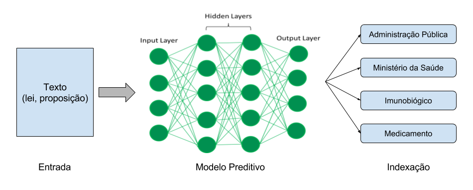

# Classificação de textos legislativos

Este projeto visa empregar técnicas de aprendizado de máquina para classificação e indexação de textos legislativos. A indexação automática de textos é fundamental para viabilizar mecanismos de consulta mais eficientes e relacionar documentos semanticamente semelhantes, como projetos de lei, notícias e normas.

Atualmente, as normas são classificadas manualmente em **39 temas**, distribuidos da seguinte forma:

| TEMA                                              | Número de normas |
|---------------------------------------------------|------------------|
| Comunicações                                      | 7065             |
| Administração Pública                             | 4675             |
| Finanças Públicas e Orçamento                     | 3335             |
| Política Fundiária                                | 2634             |
| Relações Internacionais                           | 2271             |
| Economia, Administração Financeira e Orçamentária | 2069             |
| Tributação                                        | 1108             |
| Organização Administrativa do Estado              | 1024             |
| Educação                                          | 897              |
| Viação e Transportes                              | 832              |
| Recursos Hídricos, Minerais e Política Energética | 660              |
| Trabalho e Emprego                                | 565              |
| Previdência e Assistência Social                  | 551              |
| Meio Ambiente e Desenvolvimento Sustentável       | 535              |
| Arte e Cultura                                    | 426              |
| Saúde                                             | 414              |
| Política Econômica                                | 382              |
| Indústria, Comércio e Abastecimento               | 350              |
| Desenvolvimento Regional                          | 292              |
| Agricultura, Pecuária e Pesca                     | 266              |
| Sistema Financeiro                                | 243              |
| Direito Civil e Processual Civil                  | 241              |
| Direito Penal e Processual Penal                  | 237              |
| Direitos Humanos, Minorias e Cidadania            | 233              |
| Homenagens e Datas Comemorativas                  | 232              |
| Desenvolvimento Urbano e Trânsito                 | 166              |
| Processo Legislativo                              | 146              |
| Defesa e Segurança Nacional                       | 143              |
| Ciência e Tecnologia                              | 142              |
| Segurança Pública                                 | 129              |
| Desporto e Lazer                                  | 125              |
| Turismo                                           | 57               |
| Comércio Exterior                                 | 54               |
| Direito e Defesa do Consumidor                    | 53               |
| Direito Constitucional                            | 44               |
| Organização Política, Partidária e Eleitoral      | 37               |
| Direito do Trabalho e Processual do Trabalho      | 23               |
| Informática                                       | 18               |
| Direito e Justiça                                 | 7                |


O objetivo é utilizar as informações de tematização para formar um conjunto etiquetado a ser utilizado em algoritmos de aprendizado supervisionado que resultem em modelos capazes de inferir um ou mais tópicos a partir do texto da norma.




## Extração e preparação dos dados
As informações de normas são extraídas do banco de dados do Sistema de Informação Informatizada (Legin), que armazena mais de 250 mil normas, sendo mais de 175 mil com indexação manual e pouco mais de 32 mil possuem classificação temática. Acesse o [notebook](dataset.ipynb) com detalhes da preparação dos dados.


## Treinamento e avaliação dos modelos
Para a classificação das normas em temas foram testados [métodos baseados em frequencia de palavras](classification-bag-of-words.ipynb) utilizando a biblioteca scikit-learn.


## Trabalho Futuro

Além da classificação temática, existe um trabalho de indexação manual das normas, que segue um padrão bem definido de assunto principal em caixa alta seguido de subtópicos separados por hífen. Exemplo da indexação da [Lei nº 8.666, de 21 de junho de 1993](http://www2.camara.leg.br/legin/fed/lei/1993/lei-8666-21-junho-1993-322221-norma-pl.html):

```
LICITAÇÃO - Administração Federal - Fixação - Normas - Contrato administrativo
LEI DE LICITAÇÃO
```

O número de normas indexadas (> 175 mil) é muito superior ao de normas tematizadas. Esse conjunto de dados poderia ser utilizado para aumentar o conjunto de dados tematizados (*data augmentation*) ou mesmo treinar modelos *multilabel*, capazes de atribuir várias classes *tags* a um mesmo texto.

Mais detalhes sobre as regras de indexação podem ser encontradas no [Manual de indexação de proposição legislativa](http://bd.camara.gov.br/bd/handle/bdcamara/29179).

## Referências

* [Classification of text documents using sparse features](http://scikit-learn.org/stable/auto_examples/text/document_classification_20newsgroups.html)
* [Text Classification with NLTK and Scikit-Learn](http://bbengfort.github.io/tutorials/2016/05/19/text-classification-nltk-sckit-learn.html)
* [Working With Text Data](http://scikit-learn.org/stable/tutorial/text_analytics/working_with_text_data.html)
* [Analyzing tf-idf results in scikit-learn](https://buhrmann.github.io/tfidf-analysis.html)
* [Convolutional Neural Networks for Sentence Classification](https://arxiv.org/abs/1408.5882)
* [Lex2vec: word2vec aplicado à legislação brasileira](https://github.com/thefonseca/lex2vec)
